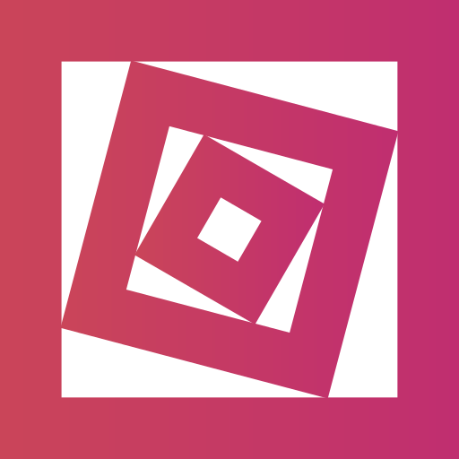

<p align="center">
	
</p>
<p align="center">
	<b>Fractal Visualizer</b>
</p>
<p align="center">
	
	
	
</p>

A simple extendable fractal visualizer written in vue. This project demonstrates the artistic side of math by generating and redrawing fractals based on user defined variables.

[Demo](https://fractal-visualizer.netlify.app/) *(deployed on Netlify)*

## Available Fractals

| Fractal          | Description   |
|------------------|---------------|
| H-Fractal        | Recursively splits a line at right angle and reduces the length by a given factor. |
| Pythagoras Tree  | Visualizes the Pythagoras Theorem by recursively drawing squares along 3 sides of a right triangle. |
| Koch Curve       | Recursively replaces the center part of a line segment with an equilateral triangle. This procedere generates 3 additional line segments for the next iteration. |
| Sierpinski Triangle | Recursively draws 3 Triangles forming a bigger fourth Triangle. |

Check out the [todo list](TODO.md) for upcoming fractals.

## Project Setup
Clone this repository
```
git clone https://github.com/felixgro/fractal-visualizer.git
cd fractal-visualizer
```
Install dependencies
```
npm install
```
Start server with hot-reloads and auto-compile for development
```
npm run serve
```